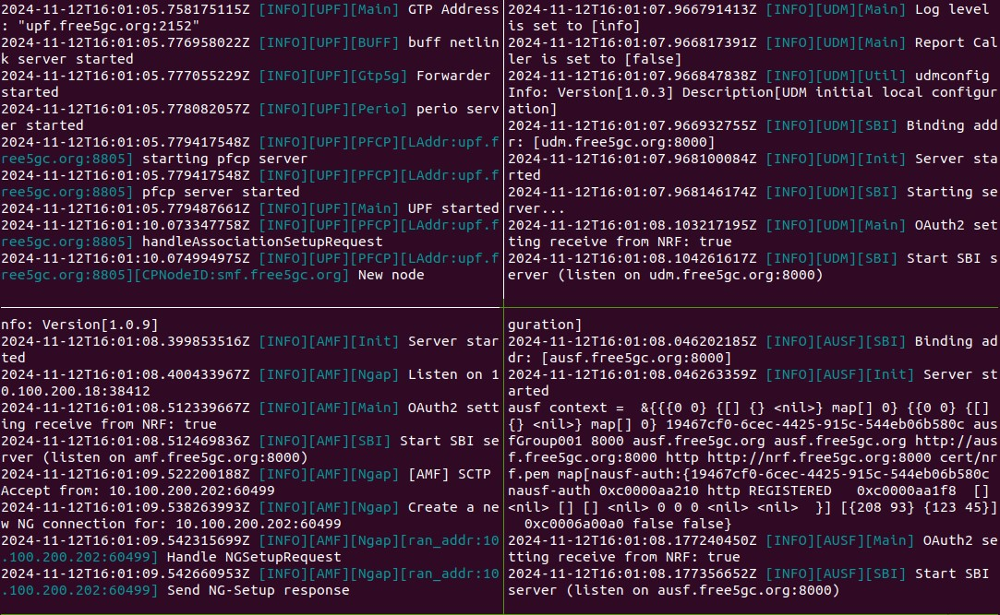
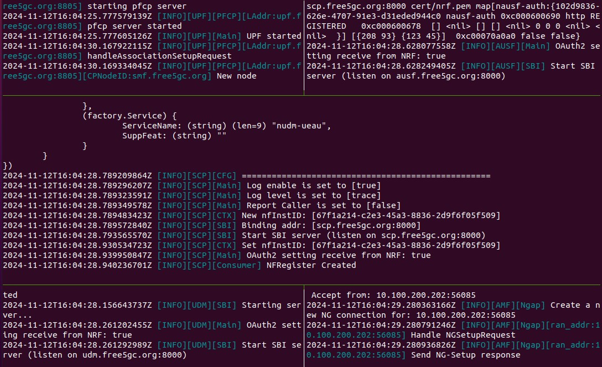

# 2024 NS - Anomaly Detector in 5G Core Network

## 1. Prerequisites
### 1.1 Install docker
```bash
sudo apt-get update
sudo apt-get install -y curl
sudo curl -ssl https://get.docker.com | sh
sudo groupadd docker
sudo usermod -aG docker $USER
newgrp docker
```
### 1.2 Install gtp5g
In order to use the gtp5g kernel module, you must use the `5.0.0-23-generic` or `5.4.x` version of the Linux kernel
```bash
cd gtp5g
sudo make && sudo make install
```
Note: 
You may need to re-install the gtp5g kernel module if the following error still occurs
`[ERRO][UPF][Main] UPF Cli Run Error: open Gtp5g: open link: create: operation not supported`
```bash
sudo make uninstall && sudo make install
```
### 1.3 Install tmux
run.sh script need it
```bash
sudo apt install -y tmux
```

## 2. Build
### 2.1 Build SCP
```bash
sudo make scp
sudo docker compose -f docker-compose-scp.yaml build
```

## 3. Run
### 3.1 Change the permissions of files
```bash
chmod +x run.sh
chmod +x config/upf-iptables.sh
```
### 3.2 Run with normal free5GC operation
#### 3.2.1 Run free5GC
```bash
./run.sh
```
This is the successful environment setup.
If there's only 3 panels without upf, you can see section 1.2 Install gtp5g


#### 3.2.2 Create subscriber via webconsole 
You can view the tutorial through this [link](https://free5gc.org/guide/Webconsole/Create-Subscriber-via-webconsole/), start from 4. Open Webconsole
#### 3.2.3 Run UERANSIM
```bash
sudo docker exec -it ueransim bash
./nr-ue -c config/uecfg.yaml
```
#### 3.2.4 Authentication succeed and UE can connect Internet
Test with
```bash
sudo docker exec -it ueransim bash
ping -I uesimtun0 8.8.8.8
```

### 3.3 Run with scp
```bash
./run.sh --with-scp
```

### 3.4 Run with scp and buggy case
```bash
./run.sh --buggy --with-scp
```
This is the successful environment setup.
If there's only 4 panels without upf, you can see section 1.2 Install gtp5g


## 4. Capture NF's packets 

### 4.1 Build NFs
You may need to build your own image in the local for capturing packets by using wireshark,
and the docker compose yaml file will need to be modified just for debugging
```bash
sudo make ${NF}
sudo docker compose -f ${your-docker-compose.yaml} build
```
Note:
In the Demo, we still use the original yaml file we provided to you, 
and you just need to submit the source code of scp

### 4.2 Pipe tcpdump to the wireshark
Note: you will need to decode TCP packets as HTTP2 in the wireshark
```bash
sudo -i
docker exec ${NF} tcpdump -i eth0 -U -w - | wireshark -k -i -
```